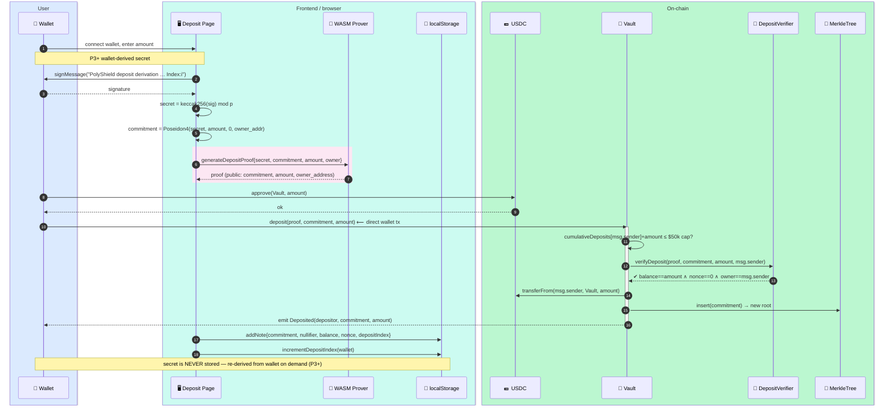
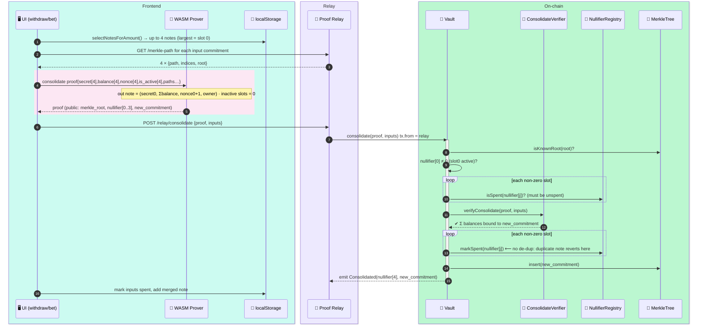

# 1 — Deposit & Note Lifecycle

[← back to index](README.md)

Covers how value *enters* the privacy set and how the client-side note store is
maintained, defragmented, and recovered.

- [1.1 Deposit (FC-2 mandatory binding proof)](#11-deposit)
- [1.2 Note consolidation (FC-8)](#12-note-consolidation-fc-8)
- [1.3 Note recovery (P3+ chain replay)](#13-note-recovery-p3-chain-replay)
- [1.4 Auto-settlement permission (ECIES — planned)](#14-auto-settlement-permission-ecies--planned)

---

## 1.1 Deposit

**Deposit is the one and only transaction the user's own wallet ever signs.** The
deposit is public by design (the depositor↔vault link is *not* hidden); what the
mandatory **FC-2 binding proof** protects is soundness: it forces the hidden note
`balance` to equal the USDC actually transferred and the hidden `owner_address` to
equal `msg.sender`. Without it, a depositor could commit a 200-USDC note while paying
100 and drain the pool (threat **T20**).



**Key checks (in order):** deposit cap → ZK binding proof → token pull → leaf insert.
The proof is verified *before* funds move; an invalid/forged proof reverts with
`InvalidProof`.

> 🟥 **Direct-to-contract variant:** calling `deposit()` directly is *fine* — deposit
> is public anyway, and the proof still binds balance↔amount. The dangerous direct
> call is `authorizeBet` (see [06-threat-paths](06-threat-paths.md)).

---

## 1.2 Note consolidation (FC-8)

Bets and credits fragment a wallet's value across many small notes. Before a
bet/withdrawal that exceeds any single note, the frontend merges up to **4** same-owner
notes into one. Pure value-preserving merge — **no token movement, no `betRecords`**.



> **Why no de-dup of nullifiers:** publishing the same note in two active slots yields
> two identical nullifiers; the second `markSpent` reverting `AlreadySpent` is the only
> thing stopping a double-count of that note's balance.

---

## 1.3 Note recovery (P3+ — backend-served events, client-side matching · FC-12)

In P3+ the secret is *never* persisted — the wallet **is** the backup. If localStorage is
wiped, the full note set is reconstructed by re-deriving secrets per index and replaying
events. **The public events come from the backend (`/recovery-data`), not a client chain
scan** (FC-12 — fast, and works under a metered RPC's getLogs cap); the **secret-based
matching stays in the browser** (privacy preserved). A direct-chain scan remains as a fallback.

```mermaid
flowchart TD
    START([User clicks Restore]):::user
    FETCH["fetch /api/recovery-data/:wallet (backend index)<br/>= this wallet's Deposited + ALL anon spend events<br/>+ blockTimestamps + feeConfig + currentRoot<br/>(fallback: direct chain scan if backend down)"]:::relay
    SIGN[Wallet signs derivation msg per index i]:::user
    EV["events: Deposited · BetAuthorized · SettlementCredited<br/>BetCancellationCredited · NACancellationCredited · PartialFillCredited<br/>Withdrawn · BetSold · PositionClosed · Consolidated"]:::relay
    DERIVE["secret_i = keccak256(sig_i) mod p<br/>commitment = Poseidon4(secret_i, bal, nonce, owner)<br/>nullifier  = Poseidon2(secret_i, nonce)"]:::fe
    MATCH{event's nullifier ==<br/>OWN derived nullifier?<br/>(only mine — can't be forged)}:::fe
    REPLAY[Replay state transitions for this index<br/>apply fee from feeConfig · cheap state reads on RPC<br/>(pendingCredit/betRecords) · pair BetSold+PositionClosed]:::fe
    GAP{5 consecutive<br/>indices with<br/>no match?}:::fe
    NEXT[i = i + 1]:::fe
    DONE([Rebuilt note cache in localStorage<br/>incl. credit notes; stale 'pending' cleared]):::fe

    START --> FETCH --> SIGN --> DERIVE
    FETCH --> EV --> MATCH
    DERIVE --> MATCH
    MATCH -- yes --> REPLAY --> NEXT --> GAP
    MATCH -- no --> GAP
    GAP -- no --> SIGN
    GAP -- "yes (hard cap 1000)" --> DONE

    classDef user fill:#dbeafe,stroke:#2563eb,color:#0b2447
    classDef fe fill:#ccfbf1,stroke:#0d9488,color:#06302b
    classDef relay fill:#ede9fe,stroke:#7c3aed,color:#2e1065
```

Matching is **fully client-side** and bounded by the wallet's own derived nullifier — so the
backend (which serves only public, anonymous events) **cannot de-anonymize or forge notes**;
worst case from a bad backend is *incomplete* recovery. No secret ever leaves the browser.
See [§4.3](04-operator-resilience.md#43-backend-indexcache--note-recovery-fc-12).

---

## 1.4 Auto-settlement permission (ECIES — planned)

> **Status: planned / "COMING SOON" in UI.** Shown for completeness — it is the *only*
> sanctioned path by which the operator ever touches a secret, and even then only an
> ECIES-encrypted blob it can decrypt with its own key.

When opted in at bet time, the user lets the operator generate the settlement proof for
them so they never have to come back online after a market resolves.

```mermaid
sequenceDiagram
    autonumber
    box rgb(204,251,241) Frontend
        participant FE as 🖥️ Bet Modal
    end
    box rgb(255,237,213) Signing Layer
        participant SL as ✍️ Operator API
        participant DB as 🔒 Operator DB (private)
    end
    box rgb(187,247,208) On-chain
        participant V as 📜 Vault
    end

    Note over FE: at bet authorization, user opts in
    FE->>FE: blob = ECIES_encrypt(operator_pubkey, {secret, nonce_after_bet})
    FE->>SL: POST /claim-permission {nullifier_of_bet, blob}
    SL->>DB: store blob keyed by nullifier_of_bet  (NEVER on-chain)
    Note over V: …later, market resolves (Phase 1 done)…
    V-->>SL: MarketResolved
    SL->>DB: load blob for nullifier_of_bet
    SL->>SL: decrypt → build settlement_credit proof on user's behalf
    SL->>V: creditSettlement(proof, …) via relay path
    Note over FE,V: opting in links W↔bet B at the operator level only;<br/>it does NOT affect any future bet's privacy
```
