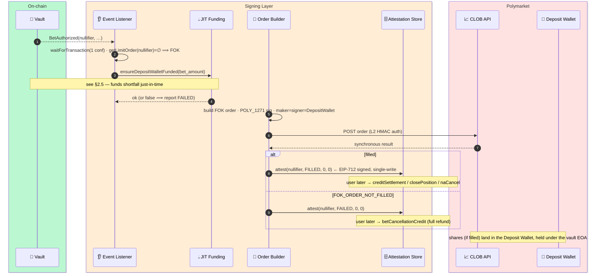
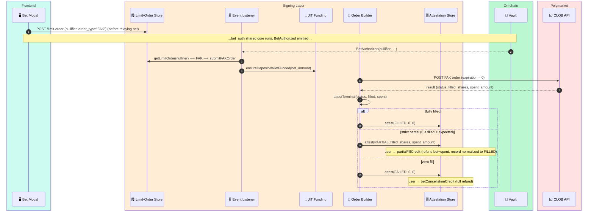
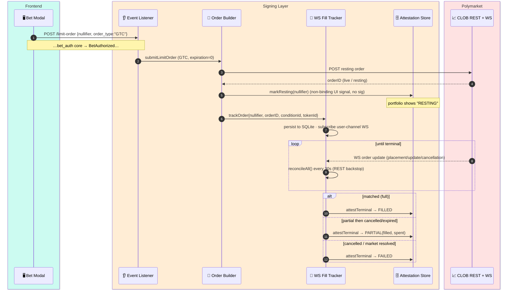
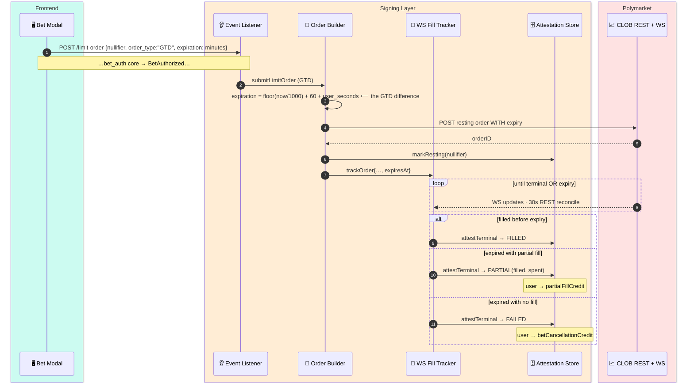
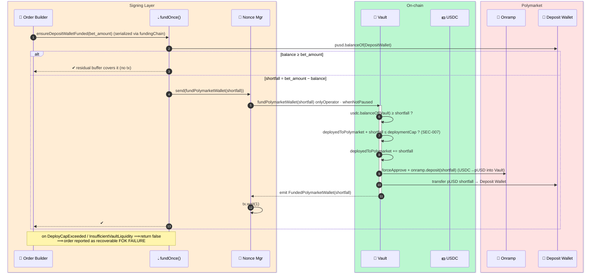

# 2 — Betting

[← back to index](README.md)

All four order types share **one circuit** (`bet_auth`, slot 0) and **one Vault entry
point** (`authorizeBet`). They diverge entirely *off-chain*, in how the Signing Layer
submits the order to Polymarket and how it tracks the fill. That divergence is why each
gets its own diagram.

- [2.1 FOK — Fill-Or-Kill](#21-fok--fill-or-kill)
- [2.2 FAK — Fill-And-Kill](#22-fak--fill-and-kill)
- [2.3 GTC — Good-Til-Cancelled](#23-gtc--good-til-cancelled)
- [2.4 GTD — Good-Til-Date](#24-gtd--good-til-date)
- [2.5 JIT collateral funding (FC-7)](#25-jit-collateral-funding-fc-7)
- [2.6 Operator attestation lifecycle (FC-9)](#26-operator-attestation-lifecycle-fc-9)

**Shared on-chain core (steps 1–9 of every order type):**

```mermaid
sequenceDiagram
    autonumber
    box rgb(204,251,241) Frontend
        participant FE as 🖥️ Bet Modal
        participant PV as 🔐 WASM Prover
    end
    box rgb(237,233,254) Relay
        participant RL as 📨 Proof Relay
    end
    box rgb(187,247,208) On-chain
        participant V as 📜 Vault
        participant BV as 🔐 BetAuthVerifier #0
        participant N as 🚫 Nullifiers
        participant T as 🌳 Tree
    end

    FE->>RL: GET /merkle-path/{commitment}
    RL-->>FE: {path, indices, root}
    FE->>FE: fee = bet_amount·betFeeBps/1e4 + relayGas; newBal = bal − bet − fee
    rect rgb(252,231,243)
        FE->>PV: bet_auth proof{secret,bal,nonce,path…, bet_amount,price,shares,market,side,position,fee}
        PV-->>FE: proof (10 public signals incl. Vault-injected fee)
    end
    FE->>RL: POST /relay/bet {proof, inputs}
    RL->>V: authorizeBet(proof, inputs)   tx.from = relay (NOT user)
    activate V
    V->>N: isSpent(nullifier)? & T.isKnownRoot(root)?
    V->>V: bet_amount ≥ minBet? · recompute fee from feeConfig
    V->>BV: verifyBetAuth(proof, inputs, fee)
    BV-->>V: ✔ newBal = bal − bet − fee
    V->>N: markSpent(old nullifier)
    V->>T: insert(new_commitment) · feeAccumulator += fee
    V->>V: betRecords[nullifier] = ACTIVE · betCreatedAt = now
    V-->>RL: emit BetAuthorized(nullifier, market, position, shares, amount, price, side, new_commitment)
    deactivate V
```

Everything below picks up at **`BetAuthorized`**, which the Signing Layer is listening for.

---

## 2.1 FOK — Fill-Or-Kill

**Semantics:** all-or-nothing, immediate. Either the full size fills at-or-better than the
limit price, or it is killed. **No partial fills, no resting.** This is the default when
the frontend registers no limit-order intent.



**Terminal states:** `FILLED` or `FAILED`. FOK can **never** yield `PARTIAL` — that is the
distinction from FAK/GTC/GTD below.

---

## 2.2 FAK — Fill-And-Kill

**Semantics:** fill *whatever is available now* at-or-better than the limit, then kill the
remainder. **Immediate** like FOK, but a partial fill is a valid outcome — so the
operator may emit a **PARTIAL** attestation, unlocking the `partialFillCredit` refund path
([§3.7](03-settlement-and-exits.md#37-partial-fill-credit-fc-4)).



**Terminal states:** `FILLED`, `PARTIAL`, or `FAILED`. Same circuit as FOK; the only
on-chain difference is which downstream credit path the resulting attestation type opens.

---

## 2.3 GTC — Good-Til-Cancelled

**Semantics:** a **resting limit order** that sits on Polymarket's book indefinitely
(`expiration = 0`) until it fills, is cancelled, or the market resolves. Because the fill
is *asynchronous*, the Signing Layer tracks it over a WebSocket with a periodic REST
reconcile, and only emits the **single terminal** attestation when the order reaches a
terminal state.



**Distinction vs FAK:** GTC *rests* (async, may live for hours/days) and gets an interim
non-binding `RESTING` UI marker; FAK is *immediate*. On market resolution, any still-
resting GTC is auto-cancelled (`cancelOrdersForMarket` → FAILED). RESTING bets are
intentionally **exempt** from `adminCancelBet`.

---

## 2.4 GTD — Good-Til-Date

**Semantics:** identical to GTC **except** the order carries an expiry timestamp
(`expiration = now + 60s + user_minutes`). When the deadline passes, Polymarket expires
the order; the fill tracker observes `expired` and resolves it to `PARTIAL` (if anything
filled) or `FAILED` (if nothing did). This auto-expiry is the only behavioural difference
from GTC.



**Terminal classification of `expired`:** `filled > 0 ⟹ PARTIAL`, else `FAILED`
(`classifyTerminal` in `wsFillTracker.ts`).

---

## 2.5 JIT collateral funding (FC-7)

Nothing is deployed to Polymarket at deposit time. Right before *every* order submission
the Signing Layer tops up the Deposit Wallet's pUSD by exactly the shortfall. Leftover
pUSD after a no-fill is **reused as a residual buffer** (no sweep-back), so exposure
accretes toward a small base buffer rather than per-bet. Bounded by SEC-007
`deploymentCap`.



---

## 2.6 Operator attestation lifecycle (FC-9)

Instead of paying gas to push fill status on-chain, the operator **signs an EIP-712
`OperatorAttestation` off-chain**; the user submits that signature with their credit
proof, and the Vault recovers the signer and injects the attested values. Gasless for
the protocol, same trust class as the old on-chain `report*`.

> **HARD INVARIANT (T22):** the operator must sign **exactly one** terminal attestation per
> bet. The chain blocks replaying the *same* signature (single-use note + terminal
> status) but cannot adjudicate two *different* valid signatures — so the single-write
> store is load-bearing.

```mermaid
flowchart TD
    EV([Order reaches terminal state]):::signer
    MAP["Map → reportType<br/>1 FILLED · 2 FAILED · 3 PARTIAL · 4 SOLD<br/>PARTIAL: amountA=filled, amountB=spent<br/>SOLD: amountA=sold, amountB=proceeds"]:::signer
    CHK{"Existing row?<br/>FILLED/FAILED/PARTIAL mutually exclusive·<br/>SOLD separate slot"}:::signer
    RET[Return existing — idempotent]:::signer
    SIGN["wallet.signTypedData(<br/>domain: Polyshield/1, chainId, Vault)"]:::signer
    INS["INSERT … ON CONFLICT DO NOTHING<br/>(single-write SQLite)"]:::signer
    STORE[(🗄️ attestation row<br/>nullifier · type · amountA · amountB · sig)]:::signer

    FETCH([User: GET /attestation/:nullifier ?reportType]):::fe
    SUB[Submit {att, sig} with credit proof via relay]:::relay
    VRF["Vault: ECDSA.recover(_hashTypedDataV4) == signingLayerOperator ?"]:::contract
    INJ[Inject attested amounts · advance BetStatus to terminal]:::contract
    REJ[revert InvalidAttestation / AttestationMismatch]:::danger

    EV --> MAP --> CHK
    CHK -- yes --> RET
    CHK -- no --> SIGN --> INS --> STORE
    STORE --> FETCH --> SUB --> VRF
    VRF -- recovers operator --> INJ
    VRF -- forged / wrong signer --> REJ

    classDef signer fill:#ffedd5,stroke:#ea580c,color:#431407
    classDef fe fill:#ccfbf1,stroke:#0d9488,color:#06302b
    classDef relay fill:#ede9fe,stroke:#7c3aed,color:#2e1065
    classDef contract fill:#bbf7d0,stroke:#16a34a,color:#052e16
    classDef danger fill:#fee2e2,stroke:#dc2626,color:#450a0a
```

**Where each attestation type is consumed:**

| reportType | Emitted by | Consumed by Vault fn | Diagram |
|---|---|---|---|
| `FILLED (1)` | FOK fill · FAK full · GTC/GTD matched | `creditSettlement`, `closePosition`, `naCancellationCredit` | [§3.2](03-settlement-and-exits.md), [§3.6](03-settlement-and-exits.md) |
| `FAILED (2)` | FOK no-fill · zero-fill · cancelled · expired | `betCancellationCredit`, `naCancellationCredit` | [§3.4](03-settlement-and-exits.md) |
| `PARTIAL (3)` | FAK/GTC/GTD strict-partial | `partialFillCredit` | [§3.7](03-settlement-and-exits.md) |
| `SOLD (4)` | FOK SELL fill (position close) | `closePosition` | [§3.6](03-settlement-and-exits.md) |
