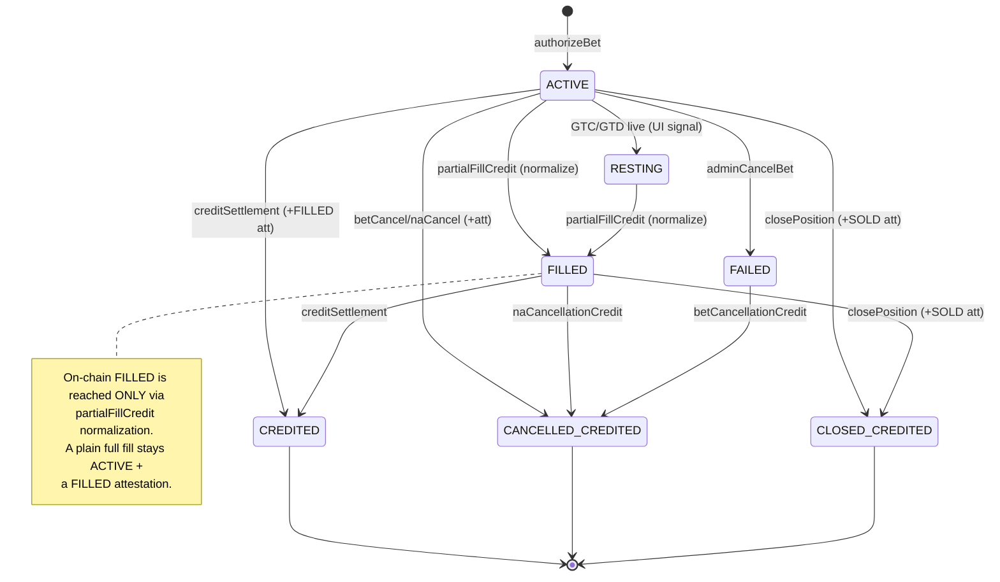
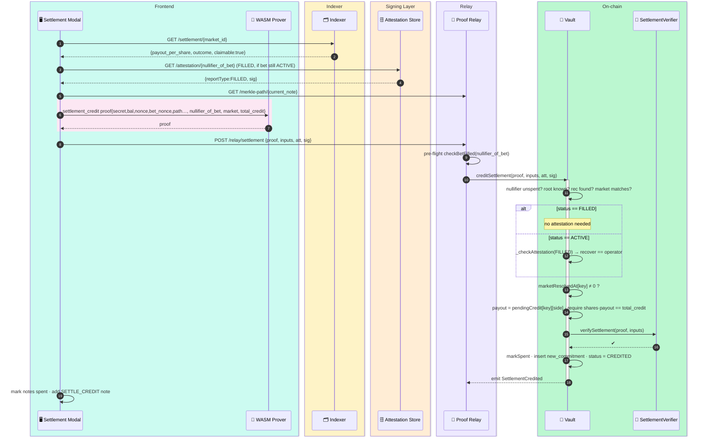
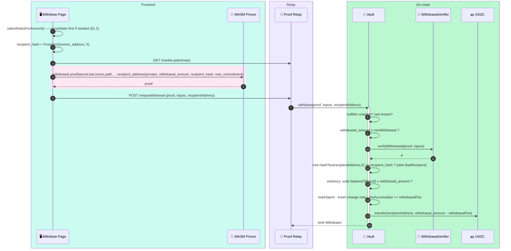
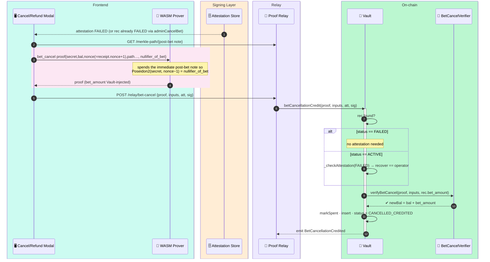
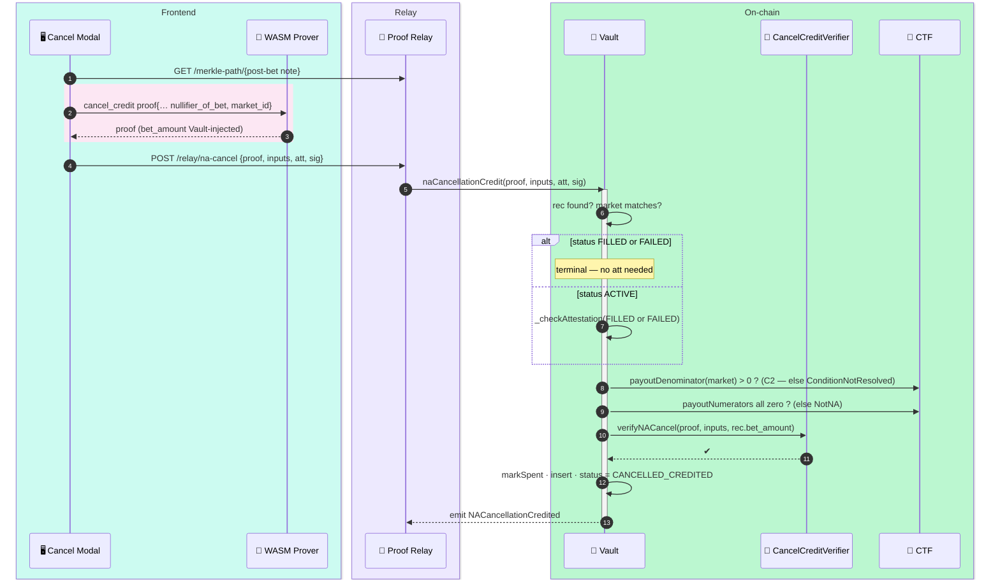
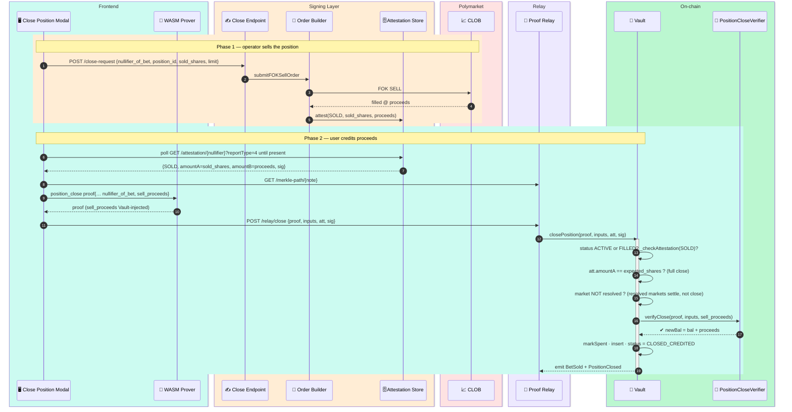
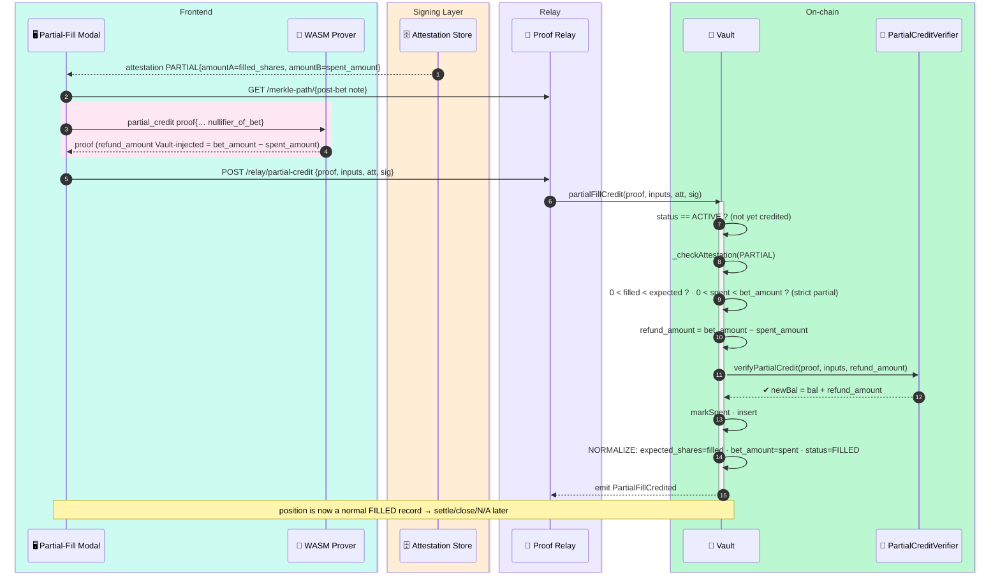

# 3 — Settlement, Credits & Exits

[← back to index](README.md)

How value is credited back into notes after a bet concludes, and how it finally leaves
the vault. Every flow here is a **note-spend**: the user spends their post-bet note,
proves membership, and recommits a new balance — routed through the Proof Relay so the
depositor never appears on-chain.

- [3.1 Settlement Phase 1 — redemption + `resolveMarket`](#31-settlement-phase-1--redemption--resolvemarket)
- [3.2 Settlement Phase 2 — credit claim](#32-settlement-phase-2--credit-claim)
- [3.3 Withdrawal (W-to-W)](#33-withdrawal-w-to-w)
- [3.4 Bet-cancellation credit (FOK failed)](#34-bet-cancellation-credit-fok-failed)
- [3.5 N/A-cancellation credit (market voided)](#35-na-cancellation-credit-market-voided)
- [3.6 Position close (FC-1)](#36-position-close-fc-1)
- [3.7 Partial-fill credit (FC-4)](#37-partial-fill-credit-fc-4)

**Bet record state machine** (the spine of this whole file):



---

## 3.1 Settlement Phase 1 — redemption + `resolveMarket`

Fully **operator/indexer-driven, no user action.** When a market resolves on-chain, the
Signing Layer records the payout (`resolveMarket`) **FIRST** so users can settle, **then**
best-effort redeems the Deposit Wallet's CTF shares, offramps the proceeds back to the
Vault, and acknowledges the returned capital. Detection is via a `tracked_markets` poll
(`payoutDenominator` state read) and/or a filtered `ctf.on` — see [§4.4](04-operator-resilience.md#44-settlement-resolver-poll--filtered-ctfon).

```mermaid
sequenceDiagram
    autonumber
    box rgb(254,226,226) Polymarket
        participant CTF as 🎰 CTF
        participant DW as 👛 Deposit Wallet
        participant OFF as 🔁 Offramp
    end
    box rgb(254,243,199) Indexer
        participant IX as 🗂️ Indexer
    end
    box rgb(255,237,213) Signing Layer
        participant SR as 📥 Settlement Resolver
        participant RP as ⚙️ Redemption Pipeline
        participant EX as 🚚 DW Executor
        participant FT as 📡 Fill Tracker
    end
    box rgb(187,247,208) On-chain
        participant V as 📜 Vault
    end

    CTF-->>SR: ConditionResolution(conditionId, numerators)
    CTF-->>IX: ConditionResolution  →  upsertSettlement(record)
    SR->>SR: waitForTransaction(1 conf)
    SR->>FT: cancelOrdersForMarket(conditionId)  → resting GTC/GTD → FAILED att
    alt all numerators zero (N/A)
        SR->>SR: skip redemption (users use naCancellationCredit)
    else resolved with payout
        SR->>RP: runRedemptionPipeline(conditionId)
        Note over RP,V: ① resolve FIRST (independent of redemption) so users can settle
        RP->>V: resolveMarket(conditionId)
        activate V
        V->>CTF: read payouts ELEMENT-by-index:<br/>getOutcomeSlotCount + payoutNumerators(cond, i)<br/>(NO array getter on mainnet CTF — FC-12)
        V->>V: pendingCredit[circuit_key][outcome] = num/den · marketResolvedAt[key]=now · conditionIdOf[key]=cond
        V-->>IX: emit MarketResolved(circuit_key, resolvedAt)  → setResolvedAt()
        deactivate V
        Note over RP,EX: ② THEN best-effort collateral redemption (failure here does NOT block settlement)
        RP->>V: scan BetAuthorized → position_ids for this condition
        RP->>CTF: balanceOf(DepositWallet, positionId) — holds winning shares?
        RP->>EX: redeem: ctf.redeemPositions(pUSD, 0, conditionId, indexSets)
        EX->>DW: WALLET batch (relayer/proxy)  → CTF burned, pUSD returned
        RP->>EX: offramp batch: approve → Offramp.withdraw → transfer USDC→Vault
        EX->>OFF: pUSD → USDC → Vault
        RP->>V: acknowledgePolymarketReturn(min(returned, deployed))
        Note over V: deployedToPolymarket -= ack
    end
```

After this, `GET /settlement/:market_id` returns `claimable: true`.

---

## 3.2 Settlement Phase 2 — credit claim

User-initiated, after Phase 1. The user spends their current cash note and recommits
`balance + total_credit`. The Vault **injects** `payout_per_share` (from `pendingCredit`)
and `shares_held` (from `betRecords`) and checks the arithmetic on-chain — the user
cannot inflate the credit.



---

## 3.3 Withdrawal (W-to-W)

Value leaves the vault. **Withdraw-to-wallet only**, enforced cryptographically: the
circuit binds `recipient_hash = Poseidon2(owner_address, 0)`, and the Vault independently
recomputes it from the passed `recipientAddress`. No mixer path. A flat `withdrawalFee`
is skimmed by the Vault (no circuit change).



> **Recipient binding (T9):** `recipientAddress` is a *private* circuit input; only its
> hash is public. An MEV bot rewriting the recipient in the relay tx invalidates the proof.

---

## 3.4 Bet-cancellation credit (FOK failed)

Full refund when an order never filled (`FAILED`). The Vault **injects `bet_amount`** from
`betRecords` so the user cannot inflate the refund.



---

## 3.5 N/A-cancellation credit (market voided)

When a market resolves N/A (all CTF `payoutNumerators` zero **with** a non-zero
denominator), the bet is refunded its `bet_amount`. The Vault checks the N/A condition
on-chain (denominator guard added by TASK-C2; status guard by TASK-C1).



---

## 3.6 Position close (FC-1)

Sell a *filled* position back on Polymarket **before** the market resolves. Two phases:
(1) the operator runs a FOK SELL and signs a **SOLD** attestation; (2) the user credits the
proceeds into their note. All-or-nothing: the attested `sold_shares` must equal the whole
held position.



---

## 3.7 Partial-fill credit (FC-4)

When a limit order (FAK/GTC/GTD) **partially** fills then terminates, the unfilled
remainder is refunded and the record is **normalized to a clean `FILLED`**
(`expected_shares := filled_shares`, `bet_amount := spent_amount`). This is the *only*
path that reaches on-chain `FILLED` — which is what makes the no-attestation FILLED branch
of settlement/close/N/A safe. Constraint-identical circuit to `bet_cancel`.


