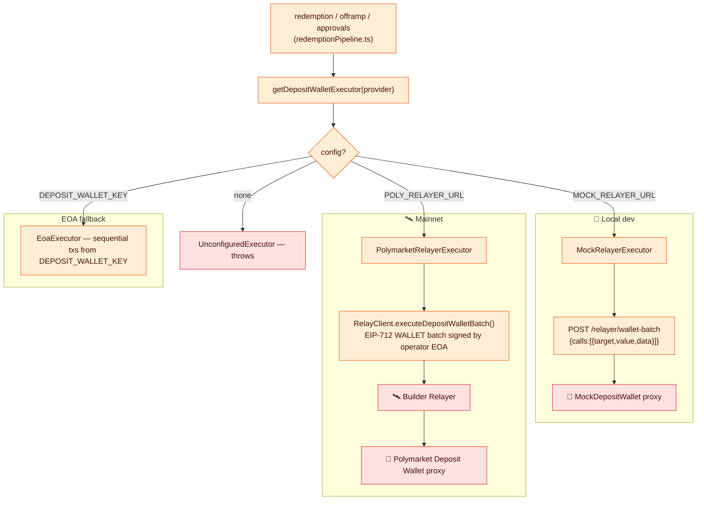
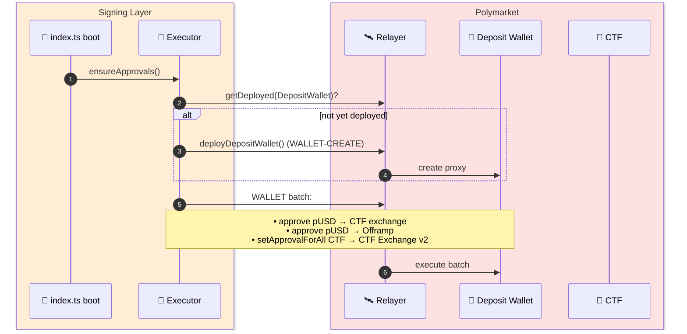
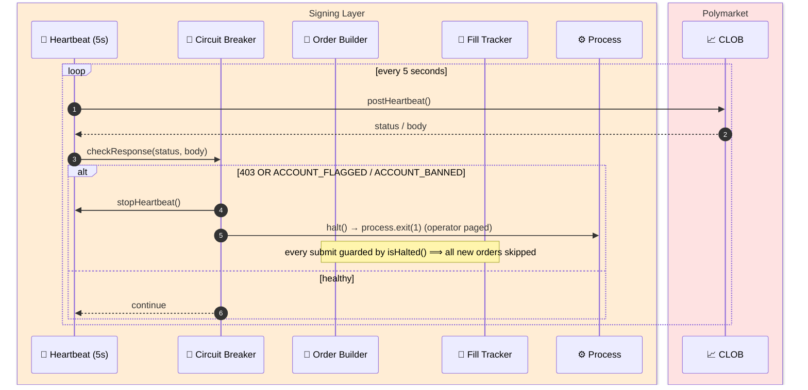
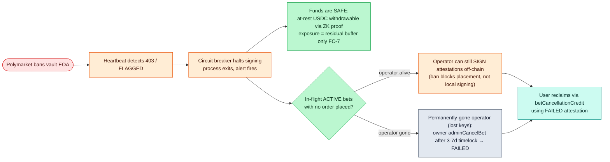
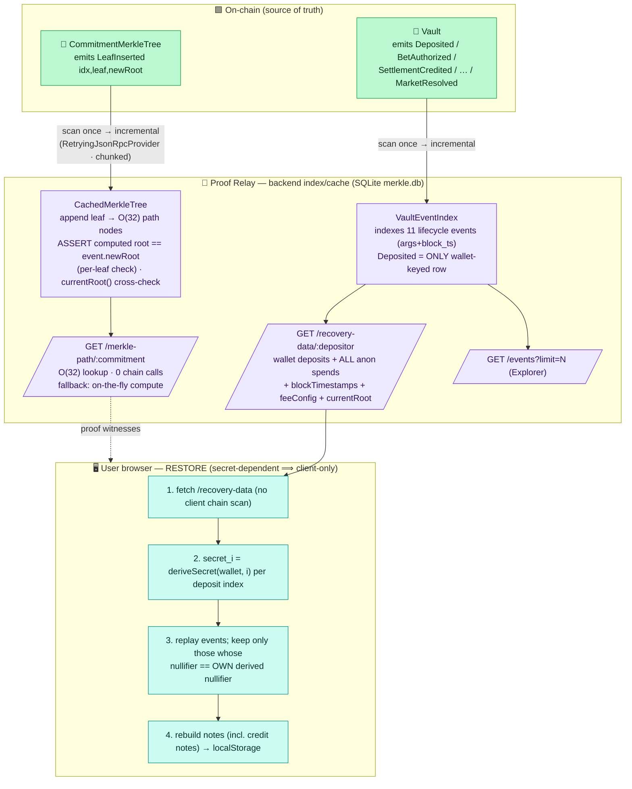
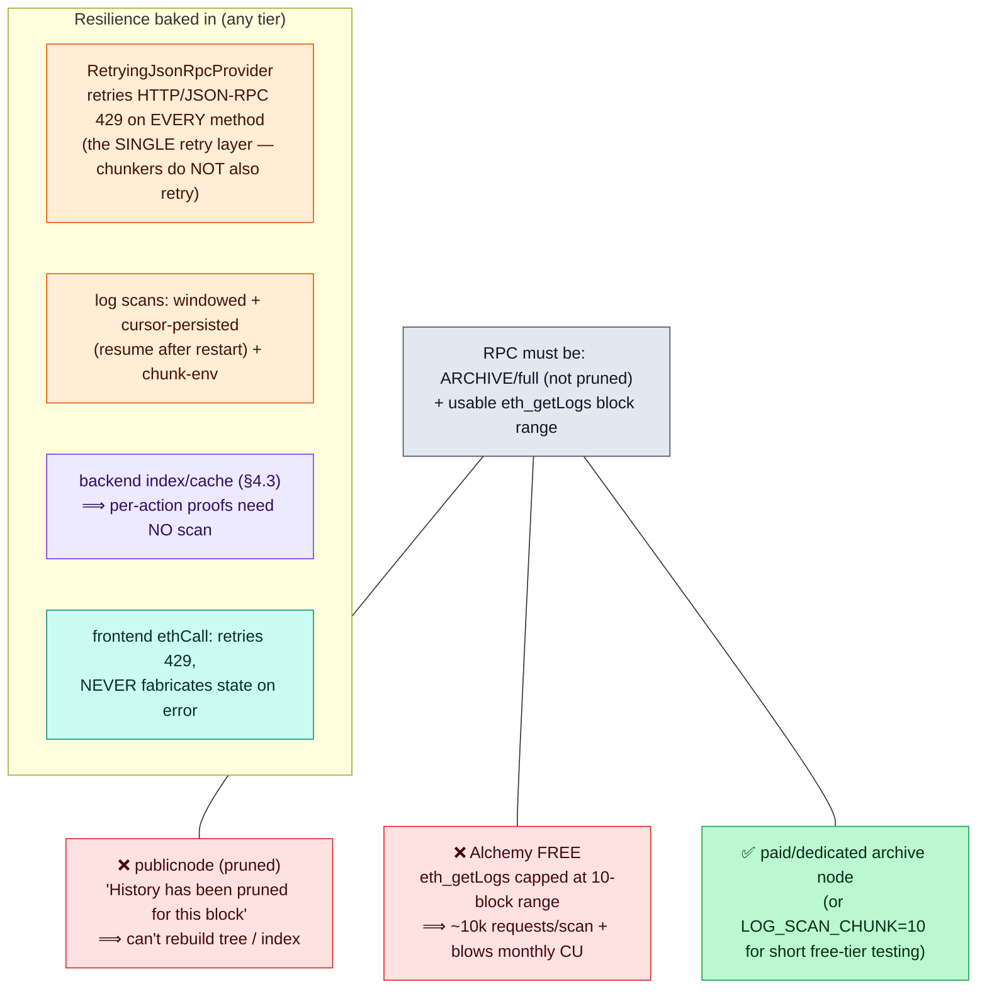

# 4 — Operator Resilience & Infrastructure

[← back to index](README.md)

The plumbing that lets the Signing Layer act on the Polymarket Deposit Wallet, and the
safety machinery that halts it when Polymarket bans the account.

- [4.1 Deposit-wallet executor (mock vs mainnet)](#41-deposit-wallet-executor-mock-vs-mainnet)
- [4.2 Heartbeat + dead-man circuit breaker](#42-heartbeat--dead-man-circuit-breaker)
- [4.3 Backend index/cache + note recovery (FC-12)](#43-backend-indexcache--note-recovery-fc-12)
- [4.4 Settlement resolver (poll + filtered ctf.on)](#44-settlement-resolver-poll--filtered-ctfon)
- [4.5 RPC resilience & requirements](#45-rpc-resilience--requirements)

---

## 4.1 Deposit-wallet executor (mock vs mainnet)

Every action *on the Deposit Wallet* (funding downstream, redemption, offramp, ERC-20 /
ERC-1155 approvals) is a **relayer → proxy batch**, abstracted behind
`DepositWalletExecutor` so the same call sites serve local dev and mainnet. The concrete
executor is chosen at startup from env.



**One-time approval bootstrap** (`ensureApprovals`, run at startup):



---

## 4.2 Heartbeat + dead-man circuit breaker

A ban (`HTTP 403` or `ACCOUNT_FLAGGED`) must halt **all** signing instantly. Two
contract-level levers complement the off-chain breaker: the owner can `pause()` the Vault,
and `adminCancelBet` ([§5.5](05-admin-governance.md#55-admin-cancel-bet-admincancelbet))
is the last resort for a permanently-gone operator.



**Full ban-recovery picture (off-chain breaker → on-chain safety net):**



---

## 4.3 Backend index/cache + note recovery (FC-12)

The proof-relay mirrors the **public** on-chain state into SQLite (`merkle.db`) so no client ever re-scans the chain. It scans **once** (windowed + cursor-persisted), then tracks new blocks incrementally. Privacy: it stores only opaque commitments + anonymous events; the secret-based matching stays in the browser.



> **Trust:** a malicious/incomplete backend can only cause *incomplete* recovery (omitting events) — it cannot de-anonymize (no secret server-side; only `Deposited` is wallet-keyed) and cannot forge notes (the replay acts only on events matching the wallet's own derived nullifier). Open hardening: client verifies the served `currentRoot` vs on-chain. The on-chain tree stays authoritative; the frontend keeps a direct-chain fallback.

---

## 4.4 Settlement resolver (poll + filtered ctf.on)

`CTF.ConditionResolution` is a **global** event (every Polymarket market fires it). The resolver must act only on the vault's **own** markets, and must work even on RPCs that don't support live filters or pruned history. Two complementary paths, both feeding one idempotent handler that runs **resolveMarket FIRST**, then best-effort redemption.

```mermaid
flowchart TB
    subgraph DETECT["Detection (two paths)"]
        ONEV["🟧 ctf.on('ConditionResolution')<br/>(live; dev/Anvil + filter-capable RPCs)"]:::signer
        POLL["🟧 poll loop over tracked_markets<br/>ctf.payoutDenominator(cond) STATE read<br/>(works on pruned/filter-less RPCs — no getLogs)"]:::signer
        FILT{conditionId ∈ tracked_markets?<br/>(vault's OWN bets only)}:::signer
        ONEV --> FILT
        POLL --> FILT
    end
    FILT -- no --> IGN["ignore (foreign global market)<br/>— prevents resolving every Polymarket market = RPC storm"]:::poly
    FILT -- yes --> H["handleResolution(conditionId)"]:::signer
    H --> RM["① resolveMarket(market_id)<br/>reads CTF ELEMENT accessor:<br/>payoutNumerators(cond,i) + getOutcomeSlotCount<br/>⟹ pendingCredit[circuit_key][side] · MarketResolved"]:::contract
    RM --> RP["② best-effort redemption pipeline<br/>redeem CTF → offramp pUSD → acknowledgePolymarketReturn"]:::signer
    RM -. "settlement enabled even if ② fails" .-> DONE([users can now creditSettlement]):::fe

    classDef signer fill:#ffedd5,stroke:#ea580c,color:#431407
    classDef contract fill:#bbf7d0,stroke:#16a34a,color:#052e16
    classDef poly fill:#fee2e2,stroke:#dc2626,color:#450a0a
    classDef fe fill:#ccfbf1,stroke:#0d9488,color:#06302b
```

> `tracked_markets` is populated per-bet by the event-listener (raw conditionId from the market registry), so the resolver knows the vault's markets without a historical `getLogs`. `resolveMarket` runs **before** the fragile relayer-dependent redemption so a redeem failure never blocks users from settling; redemption retries separately.

---

## 4.5 RPC resilience & requirements

Every backend service + the frontend read Polygon through an RPC. Two RPCs were ruled out the hard way; the resilience layer makes the rest survivable.


