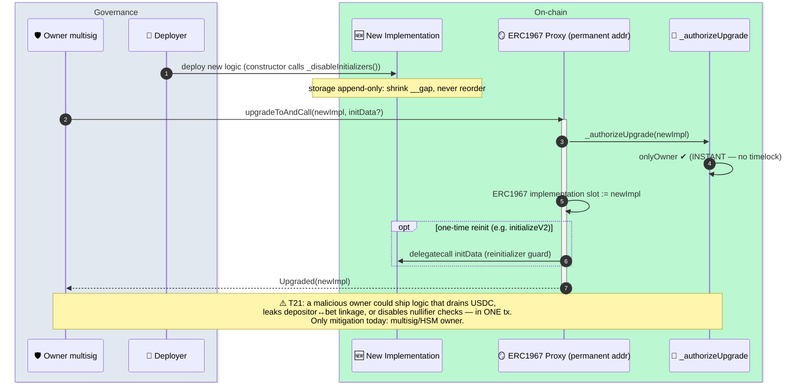
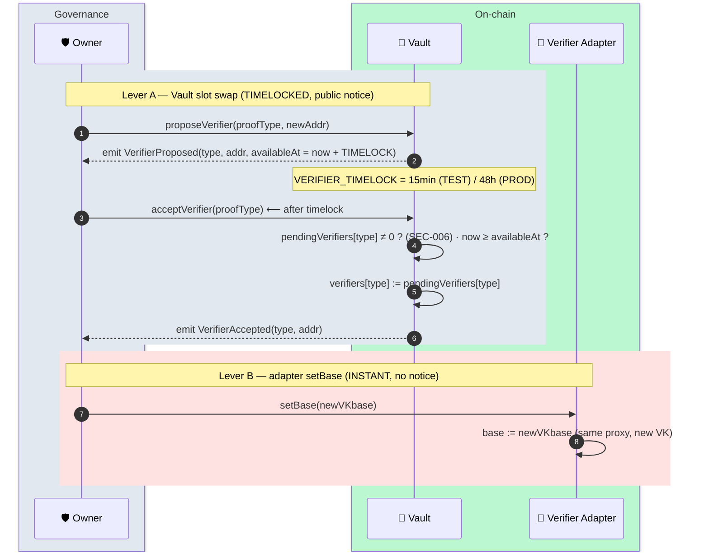
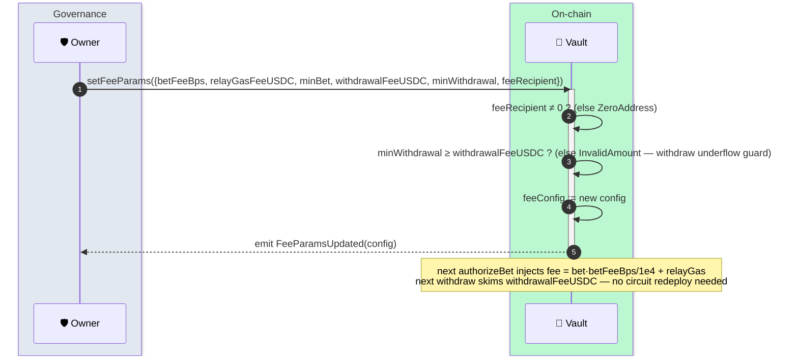
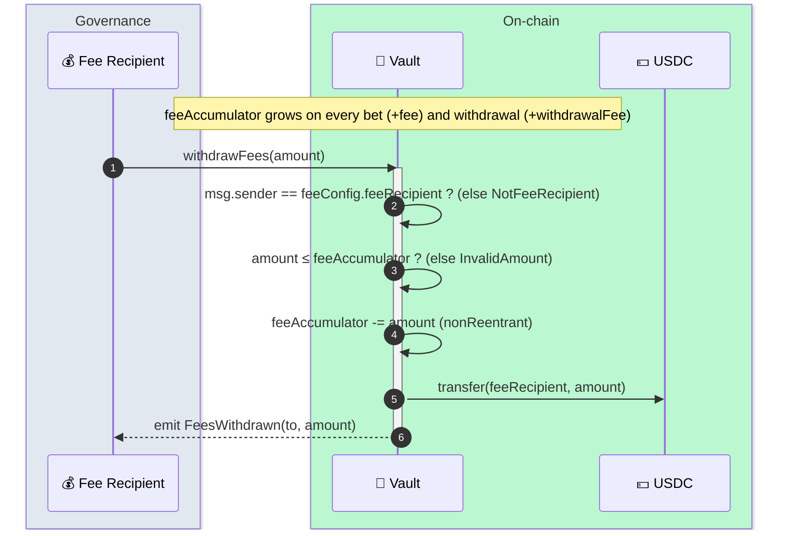
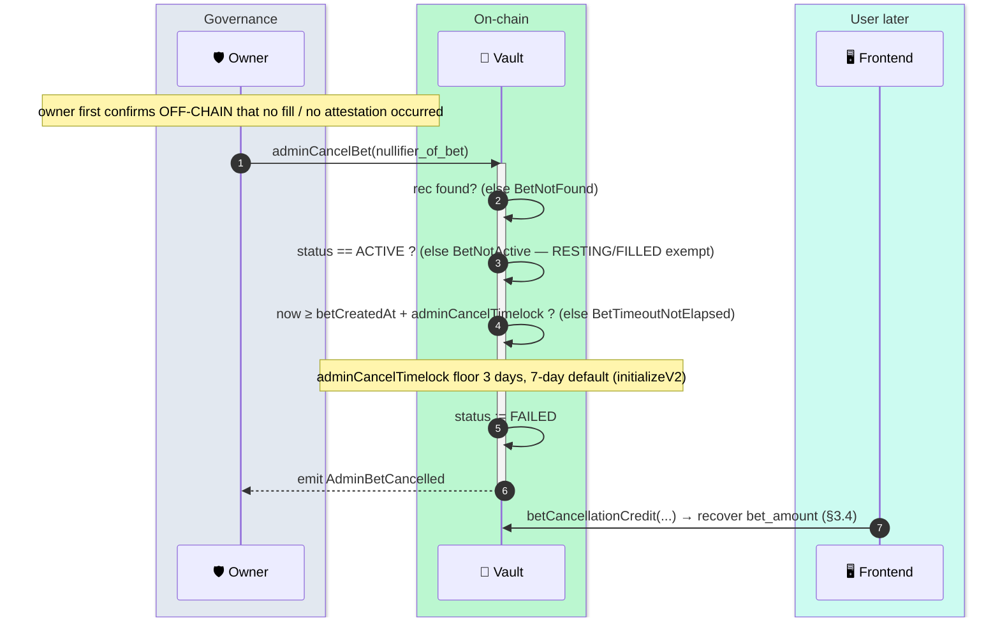
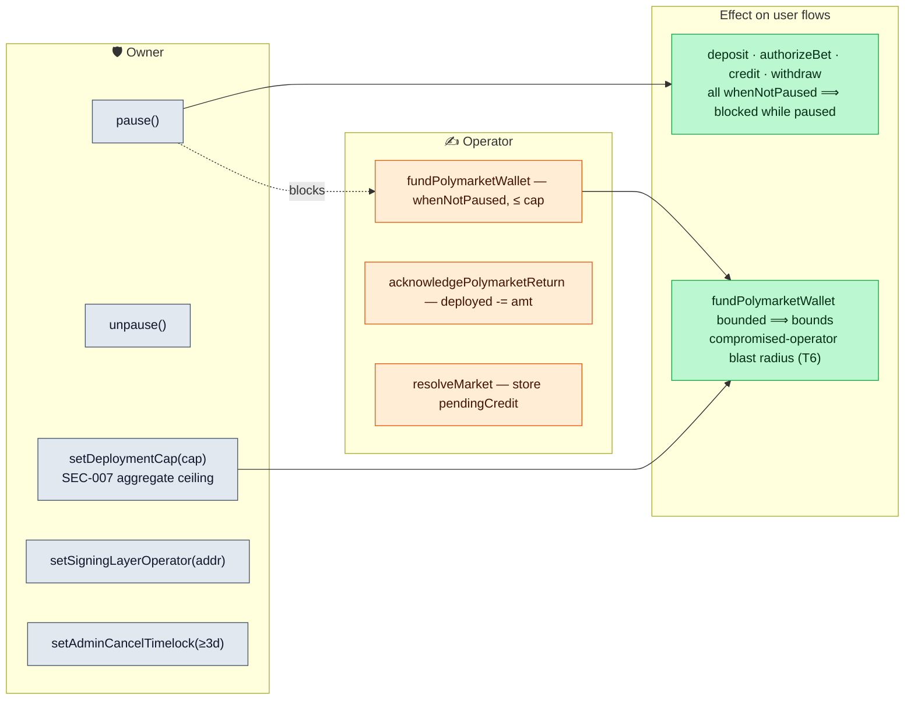

# 5 — Admin & Governance

[← back to index](README.md)

The owner-gated levers. The owner role is the **single largest trust assumption** in the
system (threat **T21**): UUPS upgrades are *instant, no timelock*, so the owner can replace
any contract's logic in one transaction. In production the owner role **MUST** be a
multisig/HSM, never a hot EOA.

- [5.1 UUPS owner upgrade (all proxies)](#51-uups-owner-upgrade-all-proxies)
- [5.2 Verifier swap (timelocked slot vs instant `setBase`)](#52-verifier-swap)
- [5.3 Fee-parameter update (`setFeeParams`)](#53-fee-parameter-update-setfeeparams)
- [5.4 Fee withdrawal / retraction (`withdrawFees`)](#54-fee-withdrawal--retraction-withdrawfees)
- [5.5 Admin-cancel bet (`adminCancelBet`)](#55-admin-cancel-bet-admincancelbet)
- [5.6 Operational levers (cap · pause · ack)](#56-operational-levers-cap--pause--ack)

**Owner authority map** (who can do what, and how fast):

```mermaid
flowchart TD
    O[🛡️ Owner multisig/HSM]:::admin
    OP[✍️ Signing Layer Operator]:::signer
    FR[💰 Fee Recipient]:::admin

    O -->|instant| UP["UUPS upgradeToAndCall — ANY proxy<br/>⚠️ total control, T21"]:::danger
    O -->|instant| SB["verifier setBase(newVK)"]:::danger
    O -->|"timelock 15m test / 48h prod"| VS["proposeVerifier → acceptVerifier"]:::admin
    O -->|instant| FP["setFeeParams"]:::admin
    O -->|instant| PA["pause / unpause"]:::admin
    O -->|instant| DC["setDeploymentCap (SEC-007)"]:::admin
    O -->|instant| SO["setSigningLayerOperator"]:::admin
    O -->|"timelock ≥3d (7d default)"| AC["adminCancelBet"]:::admin
    O -->|"min 3 days"| TL["setAdminCancelTimelock"]:::admin

    OP -->|onlyOperator| FW["fundPolymarketWallet"]:::signer
    OP -->|onlyOperator| RM["resolveMarket"]:::signer
    OP -->|onlyOperator| AK["acknowledgePolymarketReturn"]:::signer
    FR -->|onlyRecipient| WF["withdrawFees"]:::admin

    classDef admin fill:#e2e8f0,stroke:#475569,color:#0f172a
    classDef signer fill:#ffedd5,stroke:#ea580c,color:#431407
    classDef danger fill:#fee2e2,stroke:#dc2626,color:#450a0a
```

---

## 5.1 UUPS owner upgrade (all proxies)

Every production contract — `Vault`, `CommitmentMerkleTree`, `NullifierRegistry`,
`PoseidonT3Hasher`, and all 9 verifier adapters — is an implementation behind an
`ERC1967Proxy`. The **proxy address is permanent**; the logic behind it is swappable.

**Verifier adapter second lever — `setBase`:** each adapter exposes an owner-only
`setBase(address)` that adopts a new verification key *without* a proxy migration. This is
**instant** and orthogonal to the timelocked slot swap in §5.2.

---

## 5.2 Verifier swap

Two independent ways to change which verifier a proof type uses:

> The timelock on Lever A is the **public-notice window** that lets users/watchers detect a
> malicious or mistaken verifier swap before it goes live. Lever B has no such window —
> it is the faster, riskier path.

---

## 5.3 Fee-parameter update (`setFeeParams`)

All rates live in one packed `FeeConfig` struct, set atomically. The bet fee feeds the
**circuit** (Vault injects it into `bet_auth`); the withdrawal fee is Vault-only.

---

## 5.4 Fee withdrawal / retraction (`withdrawFees`)

Accrued fees sit as USDC *in the pool* (`feeAccumulator`). Only `feeRecipient` may claim
them. This is the "fee retraction" path.

---

## 5.5 Admin-cancel bet (`adminCancelBet`)

Emergency escape hatch for a **permanently-gone** operator (lost keys / fully
unresponsive). Flips an `ACTIVE` bet to `FAILED` so the user can reclaim funds via
`betCancellationCredit`. Long timelock because under FC-9 an `ACTIVE` bet may actually be a
healthy filled-but-unclaimed position.

---

## 5.6 Operational levers (cap · pause · ack)

Smaller owner/operator levers grouped together.

