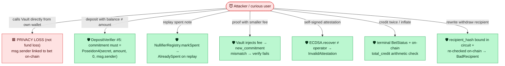
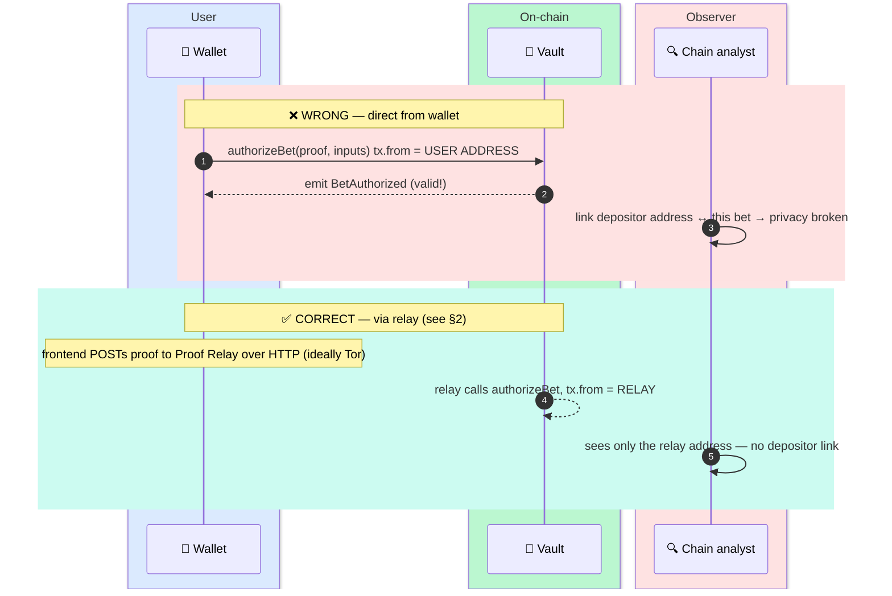
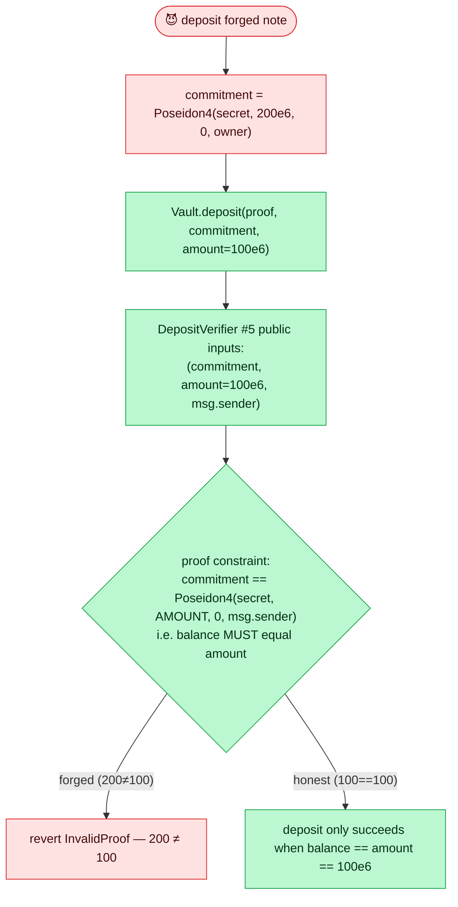
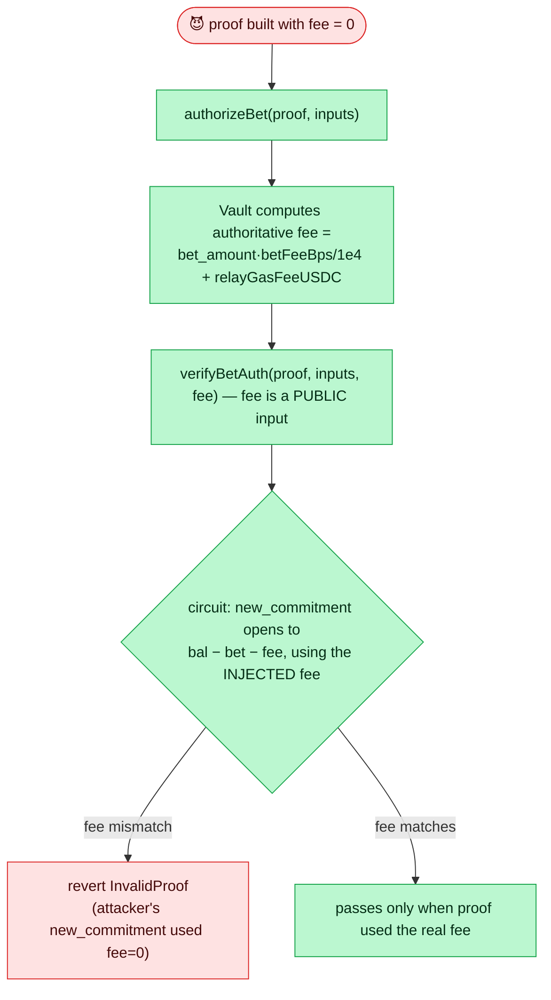
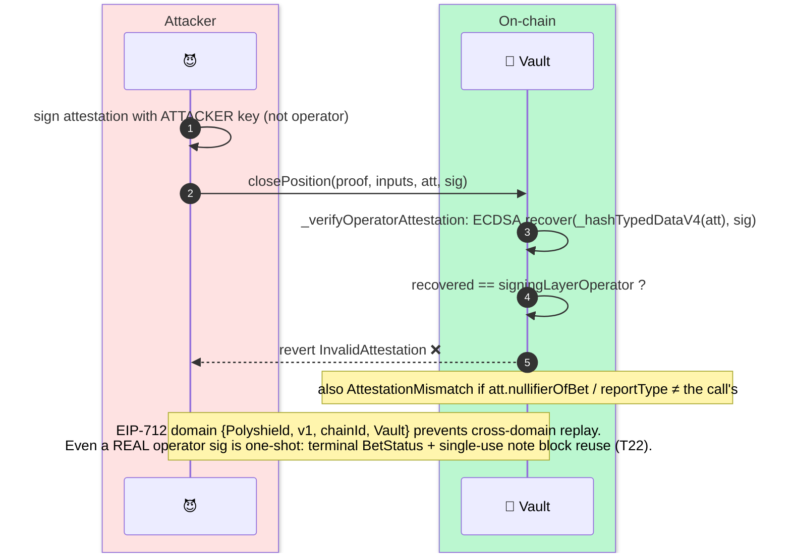
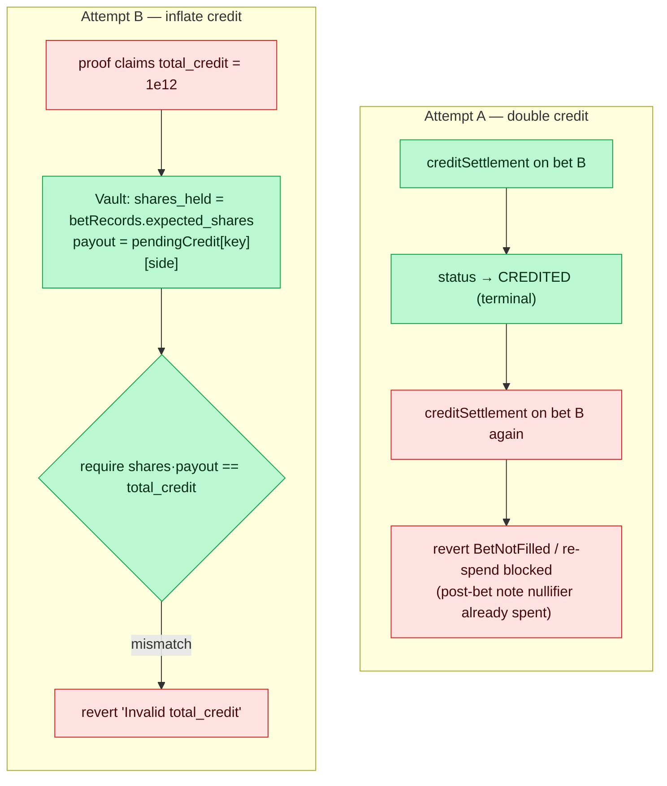
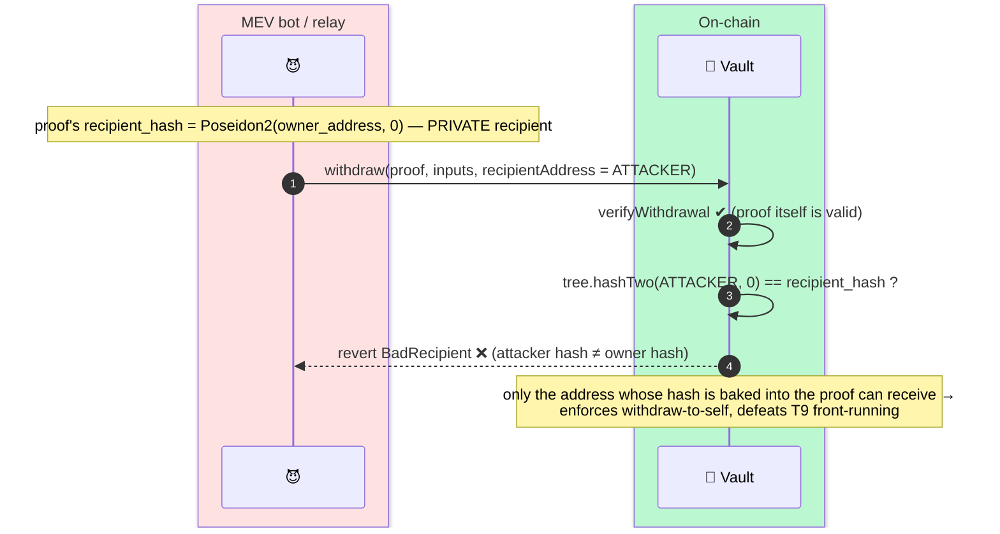
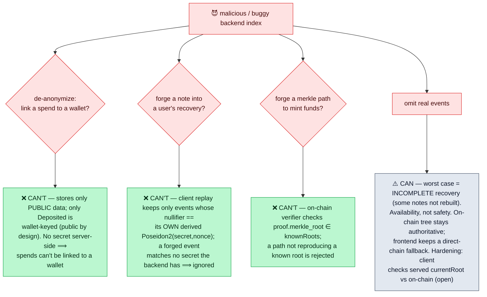

# 6 — Adversarial & Direct-Access Paths

[← back to index](README.md)

The contract layer is **permissionless** — anyone can call any non-admin Vault function
from any address. This file diagrams what happens when a curious or malicious actor
*skips the frontend/relay* and pokes the contracts directly. The recurring theme:

> **The contract enforces every *soundness* and *value* check, so funds and balances are
> safe. The one thing it cannot enforce is *privacy* — that is a client discipline.**

Cross-reference: [`docs/threat-model.md`](../threat-model.md).

- [6.1 T19 — direct `authorizeBet` self-deanonymization (the one that bites)](#61-t19--direct-authorizebet-self-deanonymization)
- [6.2 T20 — deposit-balance forgery (blocked)](#62-t20--deposit-balance-forgery-blocked)
- [6.3 T7 — nullifier double-spend (blocked)](#63-t7--nullifier-double-spend-blocked)
- [6.4 Fee under-payment forgery (blocked)](#64-fee-under-payment-forgery-blocked)
- [6.5 Operator-attestation forgery (blocked)](#65-operator-attestation-forgery-blocked)
- [6.6 Double-credit & credit inflation (blocked)](#66-double-credit--credit-inflation-blocked)
- [6.7 Withdrawal recipient redirection (blocked)](#67-withdrawal-recipient-redirection-blocked)

**Map of attacker entry points vs. what catches them:**



---

## 6.1 T19 — direct `authorizeBet` self-deanonymization

**Severity: CRITICAL (privacy).** This is the *only* direct-path attack that actually
succeeds — and it harms only the attacker themselves. `authorizeBet` deliberately does
**not** check `msg.sender` (it must be relayable by anyone), so if a user wires the bet
button to their own wallet, their address becomes `tx.from` and is permanently linked to
the bet on-chain. The proof is still valid; the *privacy invariant* is what breaks.



**Why the contract can't fix this:** requiring `msg.sender == relay` would centralize
submission and break censorship-resistance. The defense is architectural: the frontend
has *no* code path to submit any spend tx except via the relay; only `deposit()` is signed
by the user's wallet. Enforced by CLAUDE.md + a frontend test asserting no
wallet-connected `writeContract` ever targets `authorizeBet`/`creditSettlement`.

---

## 6.2 T20 — deposit-balance forgery (blocked)

**Attempt:** deposit 100 USDC but commit a note that opens to 200, then later withdraw 200
and steal 100 from the pool.



The mandatory FC-2 proof binds `balance == amount`, `nonce == 0`, `owner == msg.sender`.
There is no proofless `deposit` entry point.

---

## 6.3 T7 — nullifier double-spend (blocked)

**Attempt:** spend the same note twice (e.g. two withdrawals) for double the funds.

```mermaid
sequenceDiagram
    autonumber
    box rgb(254,226,226) Attacker
        participant A as 😈 via relay
    end
    box rgb(187,247,208) On-chain
        participant V as 📜 Vault
        participant N as 🚫 NullifierRegistry
    end

    A->>V: withdraw(proof, inputs)  [nullifier X]
    V->>N: isSpent(X)? → false
    V->>V: verify ✔
    V->>N: markSpent(X)  → X now spent
    V-->>A: payout #1 ✔
    A->>V: withdraw(same proof / same note)  [nullifier X again]
    V->>N: isSpent(X)? → TRUE
    V-->>A: revert NullifierSpent ❌
    Note over V,N: nullifier check is the FIRST op (checks-effects-interactions);<br/>consolidate deliberately skips de-dup so duplicate slots also revert here
```

---

## 6.4 Fee under-payment forgery (blocked)

**Attempt:** craft a `bet_auth` proof that deducts a smaller fee than governance requires,
keeping more balance.



Same anti-forgery pattern as Vault-injected `bet_amount` / `refund_amount` /
`sell_proceeds`: the user doesn't get to choose the value the circuit commits to.

---

## 6.5 Operator-attestation forgery (blocked)

**Attempt:** self-sign an `OperatorAttestation` (e.g. fake a SOLD with huge proceeds, or a
FILLED on a never-placed order) to credit value that was never earned.



---

## 6.6 Double-credit & credit inflation (blocked)

**Attempt A — credit the same bet twice.** **Attempt B — claim more than earned.**



Cross-function double-credit (e.g. `partialFillCredit` then `naCancellationCredit`) is
blocked by the **shared terminal statuses** (`CREDITED` / `CANCELLED_CREDITED` /
`CLOSED_CREDITED`) plus the single-use post-bet note.

---

## 6.7 Withdrawal recipient redirection (blocked)

**Attempt:** an MEV bot (or malicious relay) rewrites `recipientAddress` in the withdraw
tx to steal the payout. This is also why withdrawals are W-to-W only.



---

## 6.8 Malicious backend index / recovery-data (T24 — bounded)

**Attempt:** a compromised proof-relay index tries to de-anonymize users or fabricate notes via `/recovery-data` and `/merkle-path`.



> The index/cache is a **liveness** dependency, not a safety one. See [`threat-model.md` T24](../threat-model.md) and [§4.3](04-operator-resilience.md#43-backend-indexcache--note-recovery-fc-12).

---

## Summary — what the direct path can and cannot do

| Attack | Direct-path outcome | Guard |
|---|---|---|
| Bet from own wallet (T19) | ⚠️ **Succeeds — self-deanonymizes** | Architectural only (relay-only frontend) |
| Forge deposit balance (T20) | 🛡️ Blocked | DepositVerifier binds `balance==amount==`paid |
| Double-spend note (T7) | 🛡️ Blocked | NullifierRegistry, checks-first |
| Under-pay fee | 🛡️ Blocked | Vault-injected `fee` public input |
| Forge attestation | 🛡️ Blocked | `ECDSA.recover == operator`, EIP-712 domain |
| Double / inflate credit | 🛡️ Blocked | Terminal status + on-chain arithmetic |
| Redirect withdrawal | 🛡️ Blocked | `recipient_hash` bound + re-checked |
| Stale Merkle root | 🛡️ Blocked | 1024-root O(1) window (FC-3) |
| Backend de-anon / forge note (T24) | 🛡️ Blocked | Public-only data; client matches own nullifier; root-checked path |
| Backend omits events (T24) | ⚠️ Incomplete recovery only | Liveness not safety; direct-chain fallback |

**The single takeaway:** the contracts protect *money*; only the client protects
*privacy*. Every "blocked" row is enforced on-chain regardless of entry path — the one
red row (T19) is the user's own responsibility, and the backend index can only ever
withhold data, never steal or de-anonymize.
