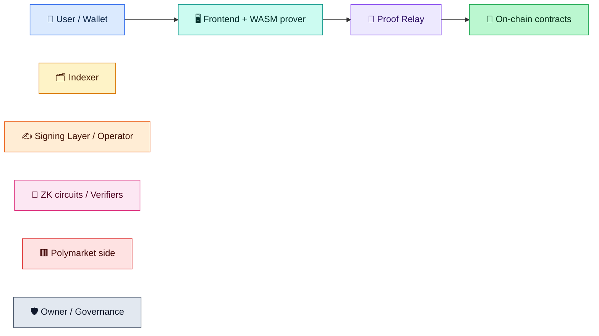
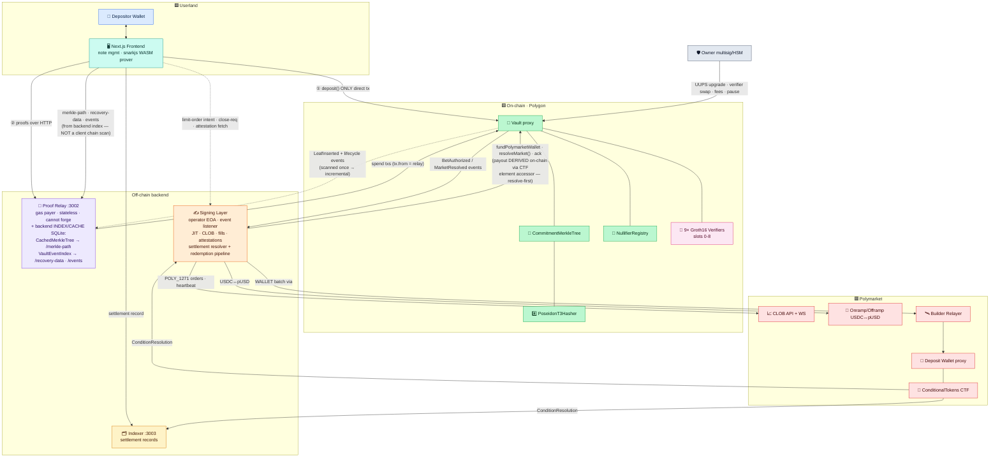

# Polyshield — Process & Path Diagrams

This directory is a visual companion to [`docs/architecture.md`](../architecture.md),
[`docs/zk-design.md`](../zk-design.md) and [`docs/threat-model.md`](../threat-model.md).
Every distinct process in the protocol — user flows, operator flows, admin/governance
levers, and adversarial direct-access paths — has its own diagram here.

> **How to view:** all diagrams are [Mermaid](https://mermaid.js.org/). They render
> automatically on GitHub and in the VS Code Markdown preview (with a Mermaid
> extension). Nothing to build.

---

## ⚠️ Reading note — three ways into the system

Polyshield is **permissionless at the contract layer**. The diagrams therefore mark
*who actually sends each transaction*, because the privacy guarantee depends on it.
Three entry paths exist for every flow:

| Path | Who | How | Privacy |
|---|---|---|---|
| 🟦 **Normal** | Honest user | Browser → Proof Relay → Vault. The user's wallet only ever signs `deposit()`. | ✅ Preserved — `tx.from` is the relay, never the depositor. |
| 🟧 **Power / direct-backend** | Advanced user, or someone who bypasses the UI | Hand-rolled proof → Proof Relay or Signing Layer HTTP API directly | ✅ Preserved if they still route through the relay; the relay cannot forge proofs. |
| 🟥 **Direct-to-contract** | Curious or malicious user | Calls `Vault.*` straight from their own wallet | ⚠️/❌ The contract still enforces every ZK/soundness check, **but** calling a *spend* function from your own wallet re-links you on-chain (T19). See [`06-threat-paths.md`](06-threat-paths.md). |

The contract trusts **proofs and Vault-injected values, never `msg.sender`** (except for
operator/owner-gated admin calls). Privacy is a *client discipline*, not a contract
enforcement — that asymmetry is the subject of the threat-path diagrams.

---

## Color & actor legend

| Color | Layer | Concrete components |
|---|---|---|
| 🟦 Blue | **User / Wallet** | Depositor's EOA (MetaMask etc.). Only signs `deposit` + EIP-191 secret-derivation messages. |
| 🟩 Teal | **Frontend** | Next.js app, `lib/notes.ts`, `lib/prover.ts`, `workers/prover.worker.ts` (snarkjs `groth16.fullProve`). |
| 🟪 Purple | **Proof Relay** | Stateless HTTP service (port 3002). Pays gas, submits all *spend* txs. Cannot forge proofs. **Also the backend index/cache** (SQLite `merkle.db`): `CachedMerkleTree` → `/merkle-path`, `VaultEventIndex` → `/recovery-data` + `/events` — serves the public on-chain state so clients never re-scan the chain. Sees only public/anonymous data; cannot de-anonymize. |
| 🟨 Amber | **Indexer** | Watches `CTF.ConditionResolution` + `Vault.MarketResolved`; serves `GET /settlement/:id`. |
| 🟧 Orange | **Signing Layer** | Operator service: event listener, JIT funding, CLOB order builder, fill tracker, attestation store (FC-9), redemption pipeline. |
| 🟩 Green | **Contracts** | `Vault`, `CommitmentMerkleTree`, `NullifierRegistry`, `PoseidonT3Hasher`, `VaultInputs` lib. |
| 🟥 Pink | **Circuits / Verifiers** | 9 Circom/Groth16 circuits + their snarkjs verifier adapters (slots 0–8). |
| 🟥 Red | **Polymarket** | CLOB API, CTF (ConditionalTokens), CollateralOnramp/Offramp, Deposit Wallet (proxy), builder relayer. |
| ⬜ Slate | **Owner / Governance** | Multisig/HSM owner: UUPS upgrades, verifier swaps, fee params, pause, admin-cancel. |

---

## High-level system architecture

---

## Diagram index

### 1 — Deposit & note lifecycle → [`01-deposit-and-notes.md`](01-deposit-and-notes.md)
- Deposit (mandatory FC-2 binding proof)
- Note consolidation (FC-8)
- Note recovery (P3+ — **backend-served** via `/recovery-data`, client-side secret matching; FC-12)
- Auto-settlement permission (ECIES — planned)

### 2 — Betting → [`02-betting.md`](02-betting.md)
- **FOK** bet (Fill-Or-Kill, all-or-nothing)
- **FAK** bet (Fill-And-Kill, partial allowed)
- **GTC** bet (resting limit order)
- **GTD** bet (resting limit order with expiry)
- JIT collateral funding (FC-7)
- Operator attestation lifecycle (FC-9, single-write store)

### 3 — Settlement, credits & exits → [`03-settlement-and-exits.md`](03-settlement-and-exits.md)
- Settlement **Phase 1** — redemption + `resolveMarket` (operator-driven)
- Settlement **Phase 2** — credit claim (user)
- Withdrawal (W-to-W)
- Bet-cancellation credit (FOK failed)
- N/A-cancellation credit (market voided)
- Position close (FC-1, secondary sale)
- Partial-fill credit (FC-4)

### 4 — Operator resilience & infra → [`04-operator-resilience.md`](04-operator-resilience.md)
- Deposit-wallet executor (mock vs mainnet relayer)
- Heartbeat + dead-man circuit breaker (ban handling)
- **Backend index/cache + recovery** (CachedMerkleTree, VaultEventIndex; FC-12)
- **Settlement resolver** (tracked_markets poll + filtered `ctf.on`)
- **RPC resilience & requirements** (RetryingJsonRpcProvider, chunked/cursor scans, archive-node / no-10-block-cap)

### 5 — Admin & governance → [`05-admin-governance.md`](05-admin-governance.md)
- UUPS owner upgrade (Vault & all proxies)
- Verifier swap (timelocked slot vs instant `setBase`)
- Fee-parameter update (`setFeeParams`)
- Fee withdrawal / retraction (`withdrawFees`)
- Admin-cancel bet (`adminCancelBet`)
- Deployment cap, pause, acknowledge-return levers

### 6 — Adversarial / direct-access paths → [`06-threat-paths.md`](06-threat-paths.md)
- T19 direct `authorizeBet` self-deanon
- T20 deposit-balance forgery (blocked)
- T7 nullifier double-spend (blocked)
- Fee under-payment forgery (blocked)
- Operator-attestation forgery (blocked)
- Double-credit & credit-inflation (blocked)
- Withdrawal recipient redirection (blocked)

---

## The 9 circuits & verifier slots (quick map)

| Slot | Const | Circuit | Used by Vault fn | Diagram |
|---|---|---|---|---|
| 0 | `BET_AUTH` | `bet_auth.circom` | `authorizeBet` | [02](02-betting.md) |
| 1 | `SETTLEMENT_CREDIT` | `settlement_credit.circom` | `creditSettlement` | [03](03-settlement-and-exits.md) |
| 2 | `WITHDRAWAL` | `withdrawal.circom` | `withdraw` | [03](03-settlement-and-exits.md) |
| 3 | `BET_CANCEL` | `bet_cancel.circom` | `betCancellationCredit` | [03](03-settlement-and-exits.md) |
| 4 | `CANCEL_CREDIT` | `cancel_credit.circom` | `naCancellationCredit` | [03](03-settlement-and-exits.md) |
| 5 | `DEPOSIT` | `deposit.circom` | `deposit` | [01](01-deposit-and-notes.md) |
| 6 | `POSITION_CLOSE` | `position_close.circom` | `closePosition` | [03](03-settlement-and-exits.md) |
| 7 | `PARTIAL_CREDIT` | `partial_credit.circom` | `partialFillCredit` | [03](03-settlement-and-exits.md) |
| 8 | `CONSOLIDATE` | `consolidate.circom` | `consolidate` | [01](01-deposit-and-notes.md) |

**Note commitment** = `Poseidon4(secret, balance, nonce, owner_address)` ·
**Nullifier** = `Poseidon2(secret, nonce)` — constant across every circuit.
